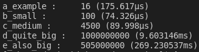
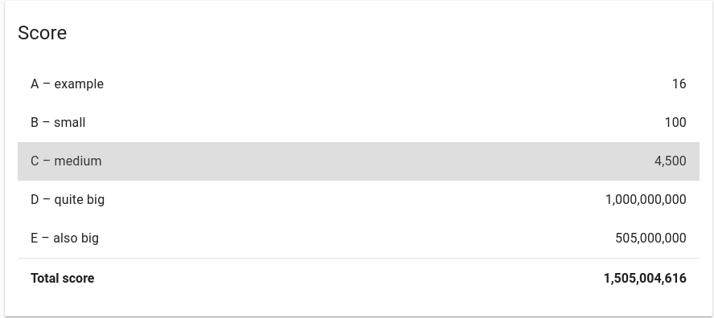

# Hash Code 2020 (Practice round)
Best solution for the practice round with maximum possible scores.
This algorithm will work for the given data sets and probably others but will need improvements to be more general.

## Problem statement
See `storage/files/slice.pdf`.

## Algorithm
From my prespective this problem was easier than what we used to in previously.

My initial thought was to add numbers starting from the end to get as close as possible to the desired maximum score (the number of guests) then use smaller numbers to fill in the gap as much as possible. I added a condition to skip any number that when added will go over the limit and continue to the next.
The difference from guest number will give me a basic idea of what I'm up against.

The result was supprizingly very close to the guest count.
* Example   : 16        (diff: 1) Can't get a better result
* Small     : 99        (diff: 1)
* Medium    : 4995      (diff: 5)
* Quite big : 999999725 (diff: 275)
* Also big  : 504999983 (diff: 17)

Now there are numbers that are better not be used in calculations, especially big numbers that in theory can be replaced by existing smaller numbers.
So I added a condition to ignore a number by its position and put the calculation in a loop.
This gave a very good result
* Example   : 16        (diff: 1) Can't get a better result
* Small     : 99        (diff: 1)
* Medium    : 4500      (diff: 0)
* Quite big : 1000000000 (diff: 0)
* Also big  : 505000000 (diff: 0)

Ok, we are almost there. Lets see what does this data set has:

```
100 10
4 14 15 18 29 32 36 82 95 95
```

Our current algorithm is adding 95 and 4, ignoring the first (`last`) 95 is useless.
We need to get past the 95 to use 82 which will give the best score with 18.

So, instead of skipping using a slice position, I need to skip any value equal to a that skipped position value.
Thus skipping both 95 numbers.

## Results
### Scores for each data set
* Example   : 16
* Small     : 100
* Medium    : 4500
* Quite big : 1000000000
* Also big  : 505000000

### Execution time
* Example   : 175.617µs
* Small     : 74.326µs
* Medium    : 89.998µs
* Quite big : 9.603146ms
* Also big  : 269.230537ms


